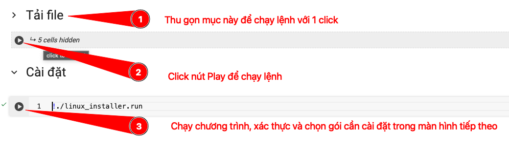
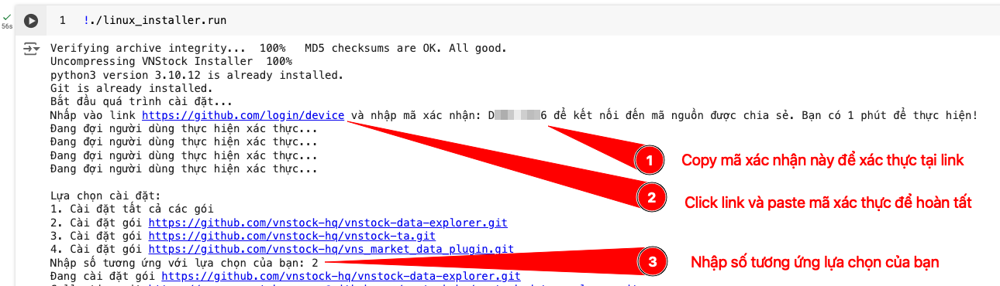

# vnstock_insider_kickstart
 Hướng dẫn cài đặt và tài liệu sử dụng dành riêng cho thành viên tài trợ dự án Vnstock

# Hướng dẫn cài đặt

> Hiện tại, bạn có thể cài đặt các gói phần mềm dành riêng cho thành viên thông qua file cài đặt tiện lợi và đây là cách cài đặt chính thức được hướng dẫn. Chi tiết cách cài đặt trên từng nền tảng máy tính và dịch vụ.

## Tải file cài đặt

Trước tiên, chọn file cài đặt tương ứng với hệ điều hành/dịch vụ mà mình sử dụng từ thư mục [oneclick_install](https://github.com/vnstock-hq/vnstock_insider_kickstart/tree/main/oneclick_installer) để tải về. 

<details>
    <summary>Xem hướng dẫn</summary>


</details>

<br>

Nếu bạn sử dụng Google Colab, clone toàn bộ repo bằng lệnh để sử dụng là cách tiện lợi nhất vì Google Colab có sẵn phần mềm Git.

```shell
!git clone https://github.com/vnstock-hq/vnstock_insider_guide
```
(*) Lưu ý: Dấu `!` trước câu lệnh cần phải có cho môi trường Colab hoặc Jupyter Notebook để chương trình hiểu lệnh này chạy với Terminal của hệ điều hành chứ không phải lệnh python.

## Google Colab / Linux

Mở link Notebook Colab mẫu tại đây:

<a target="_blank" href="https://colab.research.google.com/github/vnstock-hq/vnstock_insider_guide/blob/main/assets/Vnstock_Insider_Package_Setup_Colab.ipynb">

</a>





## macOS

> Sau khi tải file cài đặt về máy, mặc định được lưu trong thư mục `Downloads`. 

Bạn cần mở ứng dụng Terminal trên máy tính Mac thông qua Launchpad hoặc sử dụng tổ hợp phím tắt `Cmd` + `Space` sau đó nhập `Terminal` để tìm kiếm, chọn và Enter. Tiếp tục quá trình cài đặt với các bước dưới đây.

Chi tiết tại video: https://youtu.be/nBCZzXjUgoA

1. Mở thư mục `Downloads` là thư mục lưu file cài đặt mà bạn tải về từ trình duyệt web bằng câu lệnh:

```shell

cd Downloads

```

2. Trao quyền thực thi cho file `oneclick_python_vnstock3_macos.sh` để hệ thống có thể hiểu đây là file cài đặt phần mềm

```shell

chmod +x oneclick_python_vnstock3_macos.sh

```

3. Chạy file cài đặt

```shell

./oneclick_python_vnstock3_macos.sh

```
## Windows

> Trong thời gian cập nhật file cài đặt, các bạn sẽ sử dụng cách cài đặt hướng dẫn trong từng gói phần mềm với access token.

