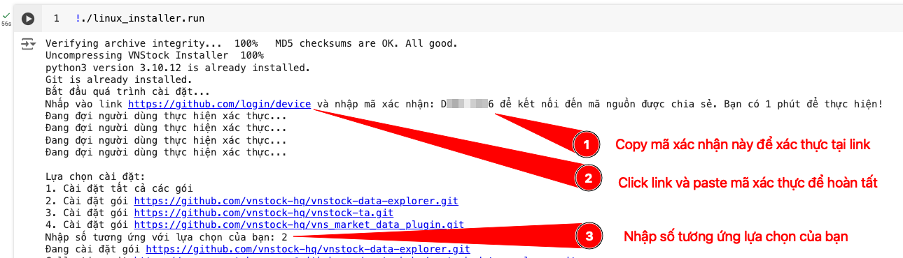

# vnstock_insider_kickstart
 Hướng dẫn cài đặt và tài liệu sử dụng dành riêng cho thành viên tài trợ dự án Vnstock

# Hướng dẫn cài đặt

> Hiện tại, bạn có thể cài đặt các gói phần mềm dành riêng cho thành viên thông qua file cài đặt tiện lợi và đây là cách cài đặt chính thức được hướng dẫn. Chi tiết cách cài đặt trên từng nền tảng máy tính và dịch vụ.

## Tải file cài đặt

Trước tiên, chọn file cài đặt tương ứng với hệ điều hành/dịch vụ mà mình sử dụng từ thư mục [oneclick_install](https://github.com/vnstock-hq/vnstock_insider_kickstart/tree/main/oneclick_installer) để tải về. 

<details>
    <summary>Xem hướng dẫn</summary>


</details>

<br>

Nếu bạn sử dụng Google Colab, clone toàn bộ repo bằng lệnh để sử dụng là cách tiện lợi nhất vì Google Colab có sẵn phần mềm Git.

```shell
!git clone https://github.com/vnstock-hq/vnstock_insider_guide
```
(*) Lưu ý: Dấu `!` trước câu lệnh cần phải có cho môi trường Colab hoặc Jupyter Notebook để chương trình hiểu lệnh này chạy với Terminal của hệ điều hành chứ không phải lệnh python.

## Google Colab / Linux




## macOS


## Windows

